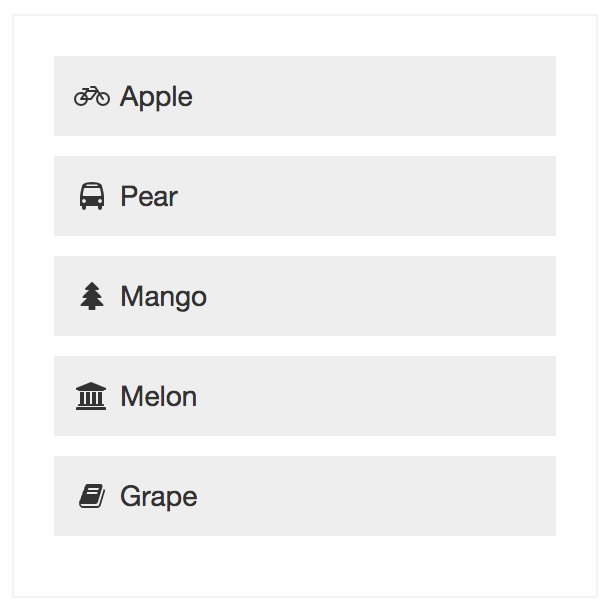

Reactlet List
=============

Reactlet list component



```
<link rel="stylesheet" href="/component/common/common-style.css"/>
<link rel="stylesheet" href="/component/list/list.css"/>

<script src="/library/react/react.js"></script>
<script src="/library/react/JSXTransformer.js"></script>
<script type="text/jsx" src="/component/common/common-mixin.js"></script>
<script type="text/jsx" src="/component/list/list.js"></script>


app.list1Data = {
    items: [
        { text:'Apple', iconClass:'fa fa-fw fa-bicycle', id:'apple' },
        { text:'Pear', iconClass:'fa fa-fw fa-bus', id:'pear' },
        { text:'Mango', iconClass:'fa fa-fw fa-tree', id:'mango' },
        { text:'Melon', iconClass:'fa fa-fw fa-bank', id:'melon' },
        { text:'Grape', iconClass:'fa fa-fw fa-book', id:'grape' }
    ]
};
app.list1 = React.renderComponent(
    <List data={ app.list1Data } />,
    document.getElementById('box1')
);
app.list1.on('select', function(id) {
    console.log('list item selected:', id);
});

```